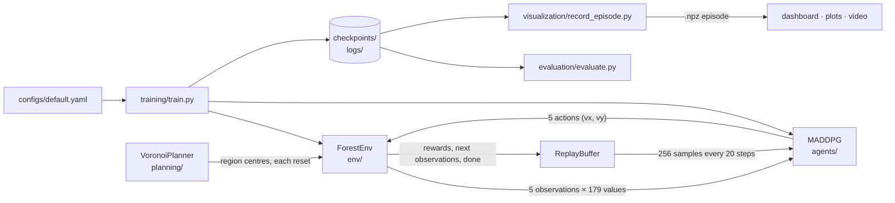

# Cooperative UAV Swarm Surveillance with MADDPG

*Agentic AI Based System for Cooperative UAV Swarm Using Multi-Agent Deep Reinforcement Learning (MADDPG) — Major Project*

Five simulated drones learn to survey a 50 × 50 forest together. Starting from a shared base, they
spread out, sense as much ground as possible, find ten targets (three of which move) and avoid
obstacles before their batteries run out. Each drone chooses its own continuous velocity from what it
observes locally; all five are trained jointly with **MADDPG** (Multi-Agent Deep Deterministic Policy
Gradient) using centralised training and decentralised execution.

On 100 noise-free test episodes, the best trained model covers **81.0 %** of the forest and detects
**82.0 %** of the targets on average ([Results](#results)).

---

## Contents

- [How it works](#how-it-works)
- [Repository structure](#repository-structure)
- [Installation](#installation)
- [Usage](#usage)
- [Configuration](#configuration)
- [Outputs](#outputs)
- [Results](#results)
- [Tests and sanity checks](#tests-and-sanity-checks)
- [Known limitations](#known-limitations)

---

## How it works



### Environment — `env/`

`ForestEnv` ([env/forest_env.py](env/forest_env.py)) is a custom multi-agent simulation that subclasses
Gymnasium's `Env`. Every `reset()` generates a new random map:

| Element | Details |
|---|---|
| Grid | 50 × 50 cells: free, obstacle, target or base |
| Obstacles | 8 random clusters, each filling about 60 % of a 7 × 7 area; UAVs cannot enter them |
| Targets | 10 on random free cells; 3 of them random-walk (up to ±0.5 cells per axis per step) until detected |
| UAVs | 5, all starting at the base cell (1, 1); positions are continuous, so a UAV can sit between cells |

Each call to `step(actions)` runs, for every active UAV:

1. **Move** — the action (vx, vy) ∈ [−1, 1]² is limited to at most 1 cell per step. If the destination
   cell is an obstacle, the UAV stays where it is (a *collision*).
2. **Battery** — 500 units; a move costs 1.2 and a blocked step 0.8, so a UAV lasts about 417 moving
   steps. At zero it becomes inactive.
3. **Sense** — after a successful move, a circular footprint of radius 5 (81 cells) marks cells as
   covered. A target is *detected* the first time a UAV comes within 5 cells of it.
4. **Reward** — see [Rewards](#rewards). Moving targets then take their step.

An episode ends after 500 steps, when coverage reaches 95 %, or when every UAV's battery is empty.
**Coverage** is the fraction of navigable cells (free and target cells) that have been sensed at least once.

### Observation — 179 values per UAV

| Part | Values | Contents |
|---|---:|---|
| Terrain patch | 121 | 11 × 11 cells around the UAV (cell type ÷ 3); cells outside the map are filled with 1.0 |
| Own state | 5 | x ÷ 50, y ÷ 50, vx, vy, battery fraction |
| Neighbours | 16 | 4 other UAVs × (relative x, relative y, battery, speed); zeros if a UAV is inactive or more than 10 cells away |
| Targets | 30 | 10 targets × (relative x, relative y, 1 if within 5 cells else 0) |
| UAV ID | 5 | one-hot index of this UAV |
| Region centre | 2 | centre of this UAV's Voronoi region ÷ 50 |

The last two parts exist because all five UAVs share one actor network and start on the same cell:
without an ID and a per-UAV region centre they would receive identical observations and choose
identical actions. Every UAV receives the relative position of all ten targets, in range or not. The
observation contains no information about which cells have already been covered.

### Rewards

Each UAV's reward for one step is the sum of:

| Term | Value | When |
|---|---|---|
| Coverage | +0.5 × (new cells ÷ 11) | After a successful move, for navigable cells in its footprint never sensed before. A cell sensed by *k* UAVs in the same step gives each 1/*k*. |
| Redundant move | −0.1 | A successful move that senses no new cell |
| Collision | −1.0 | The move was blocked by an obstacle |
| Detection | +1.0 | A target is detected for the first time |
| Battery | −0.01 | Every step the UAV is active |
| Boundary | −(2 − *d*) × 0.5 | The UAV is within *d* < 2 cells of the map edge |

11 is the number of new cells a single straight one-cell move reveals with the 81-cell footprint, so a
fully productive step earns about +0.5.

The rewards are then shared between nearby UAVs to encourage cooperation:

```text
r_i  ←  0.7 · r_i  +  0.3 · mean( r_j  for every UAV j within 10 cells of UAV i )
```

### Voronoi planning — `planning/`

`VoronoiPlanner` ([planning/voronoi_planner.py](planning/voronoi_planner.py)) splits the grid into one
region per UAV by assigning every cell to its nearest seed point, using SciPy's `KDTree`. At every
`reset()`, `ForestEnv` builds a planner from five **fixed** seeds — (5, 5), (5, 44), (44, 5), (44, 44)
and (25, 25), roughly the four corners and the centre — and puts each region's centre into that UAV's
observation.

That observation entry is the planner's only connection to learning:

- the regions do not restrict where a UAV may fly, and no reward term refers to them;
- the seeds are fixed, so every episode uses the same five regions;
- `reassign()`, `get_region_mask()` and `get_unvisited_cells()` are implemented but not called during
  training or evaluation.

The replay dashboard draws the regions for reference.

### MADDPG — `agents/`

MADDPG extends DDPG, an actor–critic method for continuous actions, to several agents. It uses
**centralised training with decentralised execution**: during training, each critic sees what every
UAV observed and did; at run time, each UAV needs only its own observation and the actor.

| Component | File | Details |
|---|---|---|
| Shared actor | [agents/actor.py](agents/actor.py) | One network used by all 5 UAVs: 179 → 128 → 128 → 128 → 2, ReLU, `tanh` output (56,322 parameters) |
| Centralised critics | [agents/critic.py](agents/critic.py) | One per UAV. Input: all 5 observations and all 5 actions, 5 × 179 + 5 × 2 = **905** values → 256 → 256 → 256 → 1 (363,777 parameters each). Used only in training. |
| Target networks | [agents/maddpg.py](agents/maddpg.py) | Slowly updated copies of the actor and every critic (τ = 0.01) |
| Replay buffer | [agents/replay_buffer.py](agents/replay_buffer.py) | Up to 1,000,000 *joint* transitions — each holds all five UAVs' data from the same step, which the critics need |
| Exploration noise | [agents/noise.py](agents/noise.py) | Independent Ornstein–Uhlenbeck noise per UAV (θ = 0.15); σ starts at 0.3 and is multiplied by 0.997 after every episode, down to 0.05. Training only. |

A learning update runs every 20 environment steps once the buffer holds at least 5,000 transitions:

1. Sample 256 joint transitions uniformly at random.
2. **Critics** — for each UAV *i*, compute the target
   `y_i = r_i + γ · (1 − done) · Q′_i(next observations, target-actor actions)` with γ = 0.99, and
   minimise the squared error between `Q_i(observations, actions)` and `y_i`.
3. **Actor** — maximise the average of the five critics' values for the actions the actor currently
   chooses. A small penalty (0.01) on pre-`tanh` outputs beyond ±3 keeps the `tanh` from saturating.
4. Clip gradient norms to 0.5 (Adam; learning rate 5 × 10⁻⁵ for the actor, 10⁻⁴ for the critics).
5. Soft-update every target network.

The networks run on a CUDA GPU when PyTorch can see one, otherwise on the CPU.

### Training loop — `training/train.py`

For each of the 1,500 episodes:

1. Reset the environment and each UAV's noise process.
2. At every step: actor + noise → actions → `env.step()` → store the joint transition → attempt an update.
3. After the episode: decay the noise, then log the episode to TensorBoard and to the history table.
4. **Every 10 episodes** (after the 5,000-step warm-up): run 10 noise-free episodes. If their mean
   coverage beats the best so far, save `maddpg_best.pt`. The best model is chosen on noise-free
   coverage because training coverage also reflects the exploration noise.
5. **Every 100 episodes**: save `maddpg_ep<N>.pt`. After the last episode: save `maddpg_final.pt` and
   the history CSV.

A checkpoint stores the weights of the actor, the five critics and all their target networks, plus the
step counter and loss histories. Optimiser state is not saved. Load one with `MADDPG.load(path)`.

---

## Repository structure

```text
.
├── main.py                     # CLI entry point (only --mode train is implemented)
├── requirements.txt
├── configs/
│   └── default.yaml            # environment, reward, MADDPG and training settings
├── env/
│   ├── forest_env.py           # ForestEnv: map generation, step(), rewards, observations
│   ├── grid.py                 # grid, obstacles, targets, sensor footprint, coverage rate
│   └── uav.py                  # UAV movement, battery, sensing, neighbours
├── agents/
│   ├── maddpg.py               # MADDPG: action selection, update, save/load
│   ├── actor.py                # shared actor network
│   ├── critic.py               # centralised critic network
│   ├── replay_buffer.py        # joint-transition replay buffer
│   └── noise.py                # Ornstein–Uhlenbeck exploration noise
├── training/
│   └── train.py                # training loop, checkpoints, TensorBoard and CSV logging
├── planning/
│   ├── voronoi_planner.py      # Voronoi partition with SciPy KDTree
│   ├── mission_controller.py   # mission layer around the policy: launch, return home, recharge, planner
│   ├── safety.py               # safety layer: obstacle, map-edge and spacing checks, safe routes
│   └── surveillance.py         # persistent patrol: fires and intruders that appear during a mission
├── evaluation/
│   ├── evaluate.py             # 100-episode evaluation of the trained policy alone
│   ├── evaluate_mission.py     # the policy with each mission layer, on the same 100 maps
│   ├── build_report.py         # interactive results report from evaluate_mission.py output
│   ├── report_template.html
│   ├── make_figures.py         # the results figure for the project report
│   └── results/                # final evaluation results: mission_100.json, patrol.json
├── visualization/
│   ├── record_episode.py       # record one episode to .npz
│   ├── pygame_dashboard.py     # interactive replay of a recorded episode
│   ├── export_web.py           # export recordings for the 3D replay
│   └── web3d/                  # 3D browser replay (three.js)
└── tests/
    ├── test_env.py             # checks on the grid, UAV and environment
    ├── test_safety.py          # safety layer
    ├── test_field_fixes.py     # mission-controller fixes for flying real drones
    └── test_voronoi_planner.py # Voronoi planner demonstration script
```

`checkpoints/` and `logs/` are created when you train and are excluded from git.

---

## Installation

The project was developed with **Python 3.10**.

```bash
git clone https://github.com/wonka05/uav-swarm-.git
cd uav-swarm-

python -m venv venv
venv\Scripts\activate            # Windows
# source venv/bin/activate       # macOS / Linux

pip install -r requirements.txt
```

Run every command from the repository root — config and checkpoint paths are relative to it.

Check the installation:

```bash
python tests/test_env.py
```

It should report `ALL 63 TESTS PASSED`.

> [!NOTE]
> Trained checkpoints are **not** in the repository (`checkpoints/` is git-ignored). In a fresh clone,
> train a model before running evaluation or recording an episode.

---

## Usage

### Train

> [!WARNING]
> `configs/default.yaml` sets `checkpoint_dir: checkpoints/final1500/` and `log_dir: logs/final1500/`,
> the folders of the reported model. A new run **overwrites** `maddpg_best.pt` and `maddpg_final.pt`
> there. Change both paths first, or copy the config and pass the copy with `--config`.

```bash
python main.py --mode train                                   # uses configs/default.yaml
python main.py --mode train --config configs/my_run.yaml      # a copy of default.yaml you created
python -m training.train                                      # same as the first line
```

Each episode prints its reward, coverage, detection, collisions and noise level. The full 1,500-episode
run took about 8.1 hours on a CPU.

`main.py` also accepts `--mode evaluate` and `--mode render`, but both only print a placeholder message,
and `--checkpoint` is parsed but not used. Use the scripts below instead.

### Monitor training

```bash
tensorboard --logdir logs/final1500
```

Logged scalars: `Reward/Mean`, `Metrics/Coverage`, `Metrics/Detections`, `Metrics/Collisions`,
`Loss/Actor`, `Loss/Critic`, `Training/Sigma`, `Training/BufferSize` and
`Eval/DeterministicCoverage`.

### Evaluate a checkpoint

[evaluation/evaluate.py](evaluation/evaluate.py) runs `n_test_episodes` (100) noise-free episodes and
prints each episode's reward, coverage, detection and collisions, followed by the means and the best
coverage and detection.

Its config and checkpoint paths are constants at the top of the file; `CHECKPOINT_PATH` points to the
final model, `checkpoints/final1500/maddpg_best.pt`.

```bash
python -m evaluation.evaluate
```

Evaluation is repeatable. Creating the `MADDPG` object seeds NumPy's global random generator (the
noise processes use seed 42), and evaluation draws no noise, so a given checkpoint always sees the same
maps and prints the same numbers. Two *different* checkpoints can see different maps after the first
episode, because moving targets consume random numbers until they are detected.

### Record and replay an episode

```bash
python visualization/record_episode.py --seed 42 --output visualization/episode_seed42.npz
python visualization/pygame_dashboard.py --input visualization/episode_seed42.npz
```

`record_episode.py` always loads `checkpoints/final1500/maddpg_best.pt`, seeds NumPy with `--seed`,
runs one noise-free episode and saves every frame to the `.npz`. Seed 42 gives a 418-step episode that
ends at 82.7 % coverage with 9 of 10 targets found.

The dashboard only replays the `.npz` — it never runs the environment or the model. It shows the map
(covered cells, sensor footprints, UAV trails, Voronoi regions), a coverage ring and coverage-over-time
curve, the targets found, each UAV's battery, status and collisions, and an event log. `--speed` sets
the starting replay speed in steps per second (default 15).

| Key | Action |
|---|---|
| Space | Play / pause |
| ← / → | Step one frame back / forward (Shift: 10 frames) |
| ↑ / ↓, + / − | Replay speed |
| R, Home | Restart from frame 0 |
| End | Jump to the last frame |
| C, F, V, T | Toggle coverage, sensor footprints, Voronoi regions, trails |
| Click the progress bar | Seek |
| Esc, Q | Quit |

Targets are labelled *animal* (the three moving ones), *fire* or *point of interest* for display only.
The labels are assigned by `record_episode.py` and never reach the environment.

### Results figure

```bash
python visualization/record_episode.py --seed 42 --mission --safety --smart-planner --coverage-target 1.0 --output visualization/episode_seed42_smart100.npz
python -m evaluation.make_figures
```

Writes `evaluation/figures/results_summary.png` from the saved results in
`evaluation/results/` and the recorded seed-42 mission (the first command records it).

---

## Configuration

Everything configurable lives in [configs/default.yaml](configs/default.yaml).

| Section | Key | Default | Meaning |
|---|---|---|---|
| `environment` | `grid_size` | 50 | Side length of the square grid |
| | `n_agents` | 5 | Number of UAVs — the code requires exactly 5 (one per fixed Voronoi seed) |
| | `n_targets` | 10 | Targets per map |
| | `obs_radius` | 5 | Radius of the terrain patch, the sensor footprint and target detection |
| | `comm_radius` | 10 | Range for neighbour observations and reward sharing |
| | `max_battery` | 500 | Battery units per UAV |
| | `max_steps` | 500 | Episode step limit |
| | `dynamic_target_ratio` | 0.33 | Share of targets that move (3 of 10) |
| | `sensor_shape` | `circle` | `circle` (81 cells) or `square` (121 cells) |
| | `coverage_threshold` | 0.95 | Coverage that ends an episode early |
| `rewards` | `coverage`, `detection`, `collision`, `redundancy`, `battery_per_step`, `cooperative_alpha` | 0.5, 1.0, −1.0, −0.1, −0.01, 0.3 | See [Rewards](#rewards) |
| `maddpg` | `gamma`, `tau` | 0.99, 0.01 | Discount factor; target-network update rate |
| | `lr_actor`, `lr_critic` | 0.00005, 0.0001 | Adam learning rates |
| | `batch_size` | 256 | Transitions per update |
| | `buffer_capacity` | 1,000,000 | Replay buffer size |
| | `update_frequency` | 20 | Environment steps between updates |
| | `hidden_actor`, `hidden_critic` | 128, 256 | Hidden-layer widths |
| | `noise_start`, `noise_end`, `noise_decay` | 0.3, 0.05, 0.997 | Exploration noise schedule |
| | `saturation_penalty`, `saturation_threshold` | 0.01, 3.0 | Actor `tanh`-saturation penalty |
| `training` | `n_episodes` | 1500 | Training episodes |
| | `save_frequency` | 100 | Episodes between periodic checkpoints |
| | `eval_frequency`, `eval_episodes` | 10, 10 | How often, and over how many episodes, the best model is re-checked |
| | `checkpoint_dir`, `log_dir` | `checkpoints/final1500/`, `logs/final1500/` | Output folders (see the warning under [Train](#train)) |
| | `init_from` | `null` | Checkpoint to warm-start from; a checkpoint with a shorter observation is zero-expanded |
| | `log_frequency` | 50 | Read but not currently used |
| `evaluation` | `n_test_episodes` | 100 | Episodes run by `evaluate.py` |
| | `render` | `false` | Not currently used |

Some values are fixed in code rather than in the config: the obstacle generator (8 clusters, size 3,
density 0.6), the base position (1, 1), the battery costs (1.2 / 0.8), the boundary penalty, the
Voronoi seeds, the 5,000-transition warm-up, the gradient clip (0.5), the noise θ (0.15) and seed (42).

---

## Outputs

| Output | Location | Written by |
|---|---|---|
| `maddpg_best.pt`, `maddpg_ep<N>.pt`, `maddpg_final.pt` | `checkpoint_dir` | `train.py` |
| TensorBoard event files | `log_dir/run_<timestamp>/` | `train.py` |
| `training_history_<timestamp>.csv` | `log_dir` | `train.py` |
| Recorded episode (`.npz`) | path given by `--output` | `record_episode.py` |
| Per-map evaluation results (`.json`) | path given by `--output` | `evaluate_mission.py` |
| Results report (`report.html`) | `evaluation/results/` | `build_report.py` |
| Results figure (`results_summary.png`) | `evaluation/figures/` | `make_figures.py` |

The history CSV has one row per episode with the columns `episode`, `mean_reward`, `coverage_rate`,
`targets_detected`, `collision_count`, `active_agents`, `actor_loss`, `critic_loss`, `noise_sigma` and
`steps`.

What the metrics mean:

- **Coverage** — fraction of navigable cells sensed at least once.
- **Detection** — fraction of the 10 targets detected.
- **Collisions** — number of UAVs whose last move was blocked, read at the final step of the episode.
  It is a snapshot, not a running total.
- **Reward** — `evaluate.py` reports the sum over all five UAVs and all steps; the CSV's `mean_reward`
  is the average of the five UAVs' episode totals.

`checkpoints/`, `logs/` and recorded episodes (`visualization/*.npz`) are git-ignored.

---

## Results

`checkpoints/final1500/maddpg_best.pt`, evaluated with `evaluation/evaluate.py` over 100 noise-free
test episodes:

| Metric | Mean | Best episode |
|---|---:|---:|
| Area coverage | 81.0 % | 95.4 % |
| Target detection | 82.0 % | 100 % |
| Collisions (UAVs blocked at the final step) | 0.16 | — |
| Episode reward (sum over 5 UAVs) | −159.79 | — |

The training run that produced this model (`logs/final1500/`):

- 1,500 episodes and 641,652 environment steps, about 8.1 hours of wall-clock time on a CPU.
- `maddpg_best.pt` was saved at **episode 760**, where the 10-episode noise-free check peaked at 88.0 %
  coverage. The 100-episode evaluation above is the more reliable figure.
- Training coverage, which includes exploration noise, averaged 64.4 % over episodes 1–100 and 76.2 %
  over episodes 1,401–1,500.

No baseline policy (random or scripted) is implemented in this repository, so these numbers are
absolute rather than relative to a reference.

---

## Tests and sanity checks

| Command | What it does |
|---|---|
| `python tests/test_env.py` | 63 checks on grid generation, UAV movement, battery and sensing, and `ForestEnv` reset, step, observation shape and termination |
| `python -m tests.test_voronoi_planner` | Prints the region sizes, the overlap between regions and a reassignment example for the planner |
| `python -m tests.test_safety` | Safety layer: corner-free routes, path checks, spacing between UAVs, return home under position error |
| `python -m tests.test_field_fixes` | Mission-controller fixes: return home, stuck-return watchdog, incident response, fire no-fly zones |

Notes:

- `tests/test_env.py` prints `PASS` / `FAIL` for each check instead of raising an error, so
  `pytest tests/` reports success even when a check fails. Run the scripts directly and read the output.
- The planner script has no assertions; it always ends with `ALL PLANNER TESTS PASSED`. It must be run
  with `-m` — `python tests/test_voronoi_planner.py` fails with `ModuleNotFoundError`.
- `test_safety.py` and `test_field_fixes.py` use `assert`, so a failure stops the run.

---

## Known limitations

- **Fixed Voronoi regions.** The regions never change and only reach the model as a 2-value region
  centre in the observation (see [Voronoi planning](#voronoi-planning--planning)).
- **No coverage memory.** The observation does not say which cells are already covered, so a UAV cannot
  tell nearby explored ground from unexplored ground.
- **Hard-coded paths.** `evaluation/evaluate.py` and `visualization/record_episode.py` load fixed
  checkpoint paths; `main.py --mode evaluate` and `--mode render` are placeholders.
- **Partial Gymnasium API.** `ForestEnv` subclasses `gymnasium.Env`, but `reset()` returns only the
  observations and `step()` returns `(observations, rewards, done, info)`, so standard Gymnasium
  wrappers will not work unchanged.
- **Time limit as terminal.** Reaching `max_steps` is treated as a true end of episode in the critic
  target.
- **Stale moving targets in the terrain patch.** Moving targets update their positions in the target
  part of the observation, but the terrain patch keeps showing them at their starting cells.
- **Outdated dimensions in some files.** The default arguments and docstrings in `agents/actor.py`,
  `agents/critic.py` and `agents/replay_buffer.py` (172, 293, 1475) are out of date. The sizes actually used come from `ForestEnv.obs_dim`: 179 per UAV and 905 per
  critic input.
